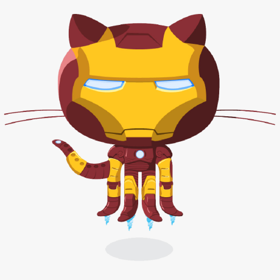

<h1 align="center">
  
</h1>

<h3 align="center">💥EM EVOLUÇÃO⚠</h3>

  <a href="#-tecnologias">Tecnologias</a>&nbsp;&nbsp;&nbsp;|&nbsp;&nbsp;&nbsp;
  <a href="#-projeto">Projeto</a>&nbsp;&nbsp;&nbsp;|&nbsp;&nbsp;&nbsp;
  <a href="#-layout">Layout</a>&nbsp;&nbsp;&nbsp;|&nbsp;&nbsp;&nbsp;
  <a href="#-Contribuidores">Contribuidores</a>&nbsp;&nbsp;&nbsp;|&nbsp;&nbsp;&nbsp;
  <a href="#-Autor">Autor</a>&nbsp;&nbsp;&nbsp;|&nbsp;&nbsp;&nbsp;
  <a href="#memo-licença">Licença</a>

 

  

 

  

## 👨‍💻 Contribuidores
❤️ Muito obrigado para essa galera que contribuiu e fez com que o projeto melhorasse! 👏

<table>
  <tr>
    <td align="center"><a href="https://www.linkedin.com/in/diegocrivelaro/">
     <b>Diego Crivelaro</b></a> </td>
    <td align="center"><a href="https://github.com/JPFregni"> <b>João Paulo Stefani Fregni</b></a> </td>
  </tr>
</table> 

## 🙋‍♂️ Autor

<a href="https://www.linkedin.com/in/leandro-bezerra-/">LEANDRO BEZERRA</a>
 

    
    
    

## 🚀 Tecnologias

Esse projeto foi desenvolvido com as seguintes tecnologias:

- HTML
- CSS
- JavaScript
- NodeJS
- EJS
- Express
- SQLite

## 💻 Projeto

O Rocket.Q é uma aplicação de interação através de perguntas, sendo possível criar uma sala para internautas anônimos fazerem perguntas e o criador da sala em posse de uma senha gerenciar essas perguntas e marcar como lidas.

## Acessibilidade

- Essa aplicação não é só focada em pessoas sem deficiência a o contrário ela é foca 100% em pessoas que tem deficiência auditiva e visual e para isso usamos o vLibras .  

<h4>AVISO</h4>
- Ele desalinha um pouco  as linhas dos ícones porém ja estou a resolver o problema

## 🔖 Layout

Você pode visualizar o layout do projeto através [desse link](https://www.figma.com/file/vp3iFfd1ohCbHyDX9jCiQi/Roquet.q). É necessário ter conta no [Figma](https://figma.com) para acessá-lo.

## :memo: Licença

Esse projeto está sob a licença MIT. Veja o arquivo [LICENSE](.github/LICENSE.md) para mais detalhes.
